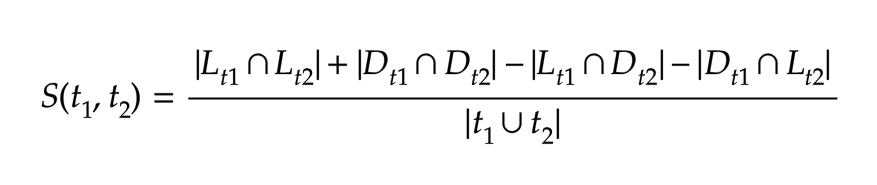

# Puzzles
Below are two software puzzles we'd like you to solve and develop against. Please read through each description and provide a solution that best satisfies the requested requirements.

## Division Solver
Write some code, in a language of your choice, that will correctly solve arbitrary serial division problems such as the following: 
```
[ [ 16 ÷ [ 8 ÷ 2 ] ÷ 4 ] ÷ 2 ÷ 80 ]
```
For simplicity the equations should be represented as nested arrays of doubles. So the previous example would be represented as:
```
[[16,[8,2],4],2,80]
```
Be sure to create a driver function that takes in a parameter of nested arrays of doubles.

## Recommender
You’ve recently come on board at our budding start up! In an effort to get to know each team member you decide to take each teammate individually out to lunch over the course of your first year. Everyone in the office considers themselves big foodies and have kept a record of their likes and dislikes towards restaurants in the area. To woo each teammate you decide to enact some crafty engineering to find an optimal restaurant recommendation that he or she hasn’t been to yet for each lunch. The algorithm you select to find these recommendations is a variant of collaborative filtering using a Jaccard similarity index. 

Using provided JSON files `seed/out/ratings.json`, `seed/out/teammates.json` and `seed/out/restaurants.json` create a program that takes in all files and a teammate id as input to display an output of the top 3 restaurants to recommend to that teammate, ordered descending by highest rated restaurants. To find these recommendations you will need to use the following two equations.

1. Finding a similarity index between Teammate 1 and Teammate 2 with a bounds between -1.0 and 1.0 



The equation returns a similarity index between two teammates by first finding the intersection between all the likes between teammate 1 and teammate 2 and adding that to the intersection of all the dislikes between teammate 1 and teammate 2. Then subtracting the subsequent sum by the intersection of the likes of teammate 1 between the dislikes of teammate 2 then transversely subtracting the difference by the intersection of the dislikes of teammate 1 between the likes of teammate 2. Finally dividing the previous sum by the union of all the ratings of teammate 1 between all the ratings of teammate 2.

2. Prediction between each teammate and a specific restaurant


Here the equation returns a prediction value between a teammate and specific restaurant. First you sum up the similarity indexes between a specific teammate and all other teammates that have liked the restaurant. Next you take the difference of that sum by the sum of similarity indexes between the specific teammate and all other teammates that have disliked the restaurant. Finally you divide this sum by the total number of teammates that have liked or disliked the restaurant.

### Additional Notes
- The similarity index is bounded between -1 and 1
- You can’t recommend a restaurant to a teammate that they’ve already been to


## Solutions Judged On
1. Correctness
1. Readability of your code
1. Test coverage
1. Performance (but don't get too hung up here, after all "premature optimization is the root of all evil")
1. Clean, commented and maintainable code

## Submission
You may write each solution in whatever language you are most comfortable with. If your solution requires external dependencies(npm packages, go packages, CocoaPods, etc), please include instructions to build and/or run. 

Place your division solver application under a `solver/` directory within this directory. Add your solution to the recommendation application under a `recommendation/` directory within this directory. Then add to either a public github repo and share with us the url OR zip up this directory and email the submission back to us.
